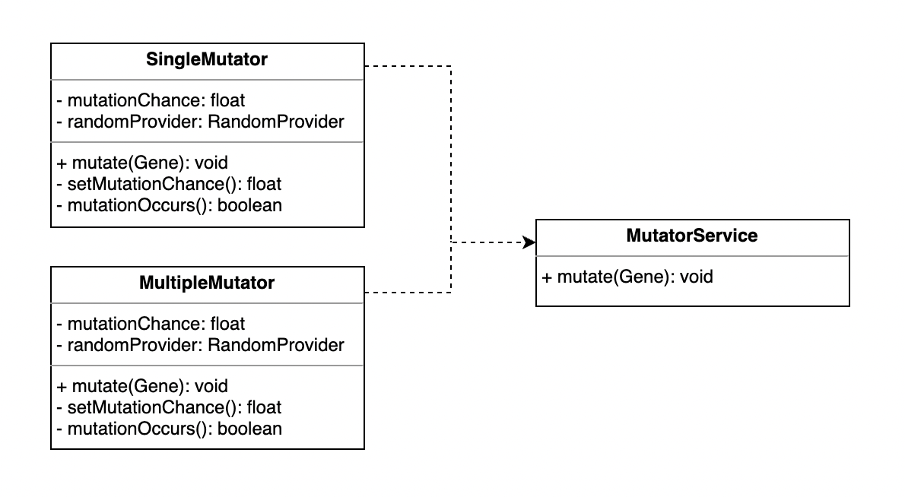

# genAlgo

<p>Simple implementation of <a href="https://pl.wikipedia.org/wiki/Algorytm_genetyczny" target="_blank">genetic algorithm</a>. Shared project to practice group collaboration.</p>
<p>Authors: Paweł Dąbrowski, Janusz Brodacki, Kamil Surowiec.</p>


## Goals:
<ul><li>working in small group</li>
<li>practicing git branching, issues and documentation</li>
<li>using TDD</li></ul>

## Development progress
<p>We are working to develop functioning Stage 5 on 19.01.2021 - Mutator.</p>

## Workflow
- We use separate branches to develop each stage of project.
- Each stage consist of at least three steps: documentation, tests and implementation. They are developed in this order and depend on each other.
    - Documentation describes the task.
    - Tests are our specification of product and we want them to describe acceptance conditions for implementation.
    - Implementation is developed at the end of the stage and it should pass all of the tests before release.
- On each stage we put tests before implementation. If during implementation step it appears, that tests are not sufficient, we extend tests before continuing.
- <b>Each task in project is developed based on an Issue</b>. If there is no Issue for your work - create one. Use Issues to report bugs or possible enhancements also.
- When stage is finished, we release it, by pulling current branch to <b>main</b>.
- Each task is developed on separate branch - naming conventions is explained below.

## Branch naming convention
- Production code is release on <b>main</b>
- Stage branches are formed as <b>dev-sX</b>, where X is number of development stage.
- Task branches follow this pattern: <b>X-Label</b>, where X is number of an Issue and Label is short description.

## Stage 1
<p>Creation of Gene class, which is base fundament of our model. Adding RandomProvider interface to test creation of random genes.</p>

## Stage 2
<p>Creation of Evaluator interface and its implementation. </p>

## Stage 3
<p>Documentation refactoring, added new section Code Structure which describe structure of program.</p>
<p>Gene class refactor, gene has field with single char insted of char array.</p>

## Stage 4
<p>Creation of CrossoverService to provide gene values recombination in order to find optimal solution in next generation.</p>
<p>Another Gene docs refactor.</p>

## Stage 5
<p>Creation of MutatorService to provide mutation of gene values after cross recombination. </p>
    
## Code Structure
### Gene
```
class Gene
 
private final RandomProvider
private char value
private float fitness

private void generateValue() 
// getters and setters for value and fitness
```


Gene has two fields char value and float fitness, generateValue() method use RandomProvider interface to randomly generate char value. It has also getters and setters for its fields: value and fitness.

### Evaluator
```
interface Evaluator
    void setFitness(Gene)
```

Evaluator has method setFitness(Gene) to calculate and assign calculated value of fitness to gene field fitness.
Evaluator count fitness only by comparing two char. One current value in gene with target char
Target char should be passed to Evaluator as argument in constructor.
There are two implementations of Evaluator: LogarithmicEvaluatorImpl and MaxDeltaEvaluatorImpl.

> Formulas for setFitness() method:
>
> LogarithmicEvaluatorImpl:  1 / (1+log<sub>10</sub>(1+delta))
>
> MaxDeltaEvaluatorImpl: (65535 - delta) / 65535
>
> where:
>
> delta - Absolute value of difference between target and current char
>
> 65535 - value equal to Character.MAX_VALUE


### Crossover
<p>CrossoverService, an interface responsible for changing gene values (mix their values) to increase their chances 
to match with optimal solution during next generation.</p>

```
interface CrossoverService
    void cross(Gene g1, Gene g2)
```


<p>Multiple implementations (strategies) describe how provided Gene objects should be changed:</p>

| Strategy                          | gene 1                        | gene 2                        |
| --------------------------------- | ----------------------------- | ----------------------------- |
| MixingHalvesCrossoverServiceImpl  | 2nd byte copied from g2       | 2nd byte copied from g1       |
| OddBitsCrossoverServiceImpl       | odd bits copied from g2       | odd bits copied from g1       |
| EvenBitsCrossoverServiceImpl      | even bits copied from g2      | even bits copied from g1      |
| BitPairCrossoverServiceImpl       | even bit pairs copied from g2 | even bit pairs copied from g1 |

### Mutator
<p>MutatorService, an interface responsible for mutating gene values. Based on given strategies selected bits changing its value in order to
    faster find target. </p>
<p>Classes that implement MutatorService have additional mutationChance float field that is set in setter (takes random value from 0 - 1) and represents probability of mutation in percent (0 - 100%). Set in seter because in each generation of Gene mutationChance can be different</p>

```
interface MutatorService    
    void mutate(Gene gene)
```

<p>Two implementations (strategies) describe how provided gene object is mutated.</p>

| Strategy         | Description                                                                                                        |
| -----------------| -------------------------------------------------------------------------------------------------------------------|
| SingleMutator    | take one bit from random position (0 - 15) and then assign opposite value for this bit (0 or 1)                  |
| MultipleMutator  | first take random number that represents number of bits to mutate (0 - 15), then in a loop take one bit from random <br> position (0 - 15) and assign opposite value to this bit (0 or 1). We allow that the same bit can change many times.  |


    
### Utils
#### RandomProvider

```
interface RandomProvider
    int getInt(int bound)
    float getFloat()
```
RandomProvider is a helper class for mocking, to enable tests for classes taking random input.


#### BitwiseUtils
```
class BitwiseUtils
    int getBit(int number, int index)
    int setBit(int number, int index, int value) throws IllegalArgumentException
    int getByte(int number, int index)
    int setByte(int number, int index, int value) throws IllegalArgumentException
```
BitwiseUtils provides methods to read and write bits and bytes from given number.<br/>
`index` is a position of bit or byte (starting with 0 for least significant bit)<br/>
`value` is target value of bit (0 or 1) or byte (0 to 255)<br/>
`throws IllegalArgumentException` when `index` is negative number or `value` is out of expected range.

