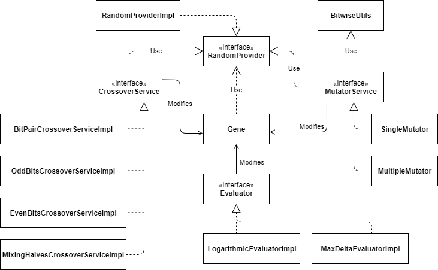
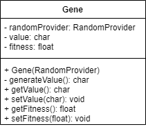
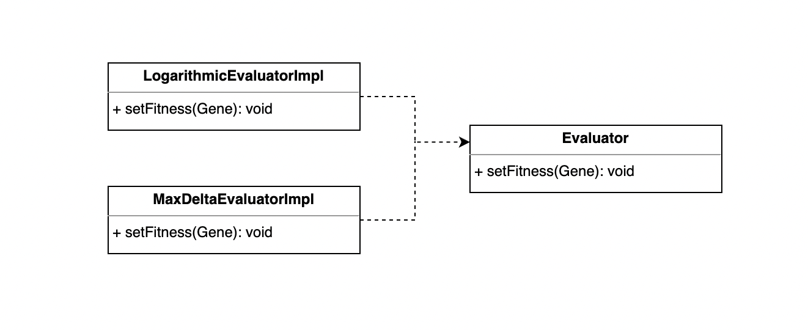
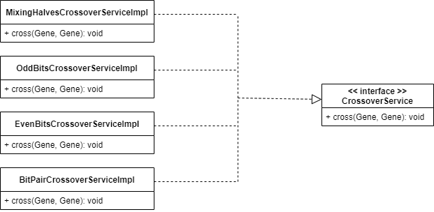
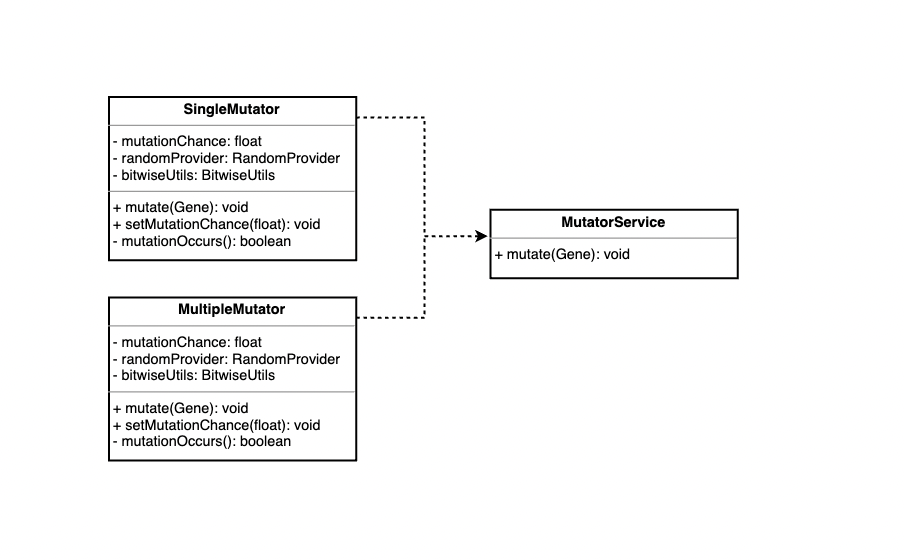
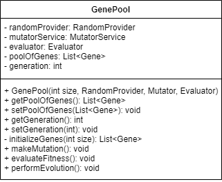
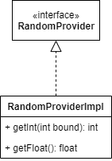
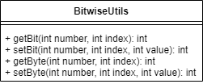

# genAlgo

<p>Simple implementation of <a href="https://pl.wikipedia.org/wiki/Algorytm_genetyczny" target="_blank">genetic algorithm</a>. Shared project to practice group collaboration.</p>
<p>Authors: Paweł Dąbrowski, Janusz Brodacki, Kamil Surowiec.</p>

#### Table of contents:
[Algorithm Working Principle](#algorithm-working-principle)<br/>
[Goals](#goals)<br/>
[Development Progress](#development-progress)<br/>
[Workflow](#workflow)<br/>
[Branch naming convention](#branch-naming-convention)<br/>
[Project history](#project-history)<br/>
[Code structure](#code-structure)<br/>



## Algorithm Working Principle

1. First Step
   * All Genes are initialized
   * Fitness is counted for each gene and assigned to it
2. Perform evolution Step
   * CrossoverHandler merge genes into pairs based on their fitness, and then crossover perform cross method on these genes
   * Mutator check if a mutation occurs, if yes then perform proper mutation
   * Evaluator count new fitness for each gene and assign them new value of fitness
   * SolutionFinder checks final condition, if final conditions are not met then perform evolution step is repeated

## Goals:
<ul><li>working in small group</li>
<li>practicing git branching, issues and documentation</li>
<li>using TDD</li></ul>

## Development progress
<p>We are working to develop functioning Stage 10 on 24.02.2021 - GenePoolService.</p>

## Workflow
- We use separate branches to develop each stage of project.
- Each stage consist of at least three steps: documentation, tests and implementation. They are developed in this order and depend on each other.
    - Documentation describes the task.
    - Tests are our specification of product and we want them to describe acceptance conditions for implementation.
    - Implementation is developed at the end of the stage and it should pass all of the tests before release.
- On each stage we put tests before implementation. If during implementation step it appears, that tests are not sufficient, we extend tests before continuing.
- <b>Each task in project is developed based on an Issue</b>. If there is no Issue for your work - create one. Use Issues to report bugs or possible enhancements also.
- When stage is finished, we release it, by pulling current branch to <b>main</b>.
- Each task is developed on separate branch - naming conventions is explained below.

## Branch naming convention
- Production code is release on <b>main</b>
- Stage branches are formed as <b>dev-sX</b>, where X is number of development stage.
- Task branches follow this pattern: <b>X-Label</b>, where X is number of an Issue and Label is short description.

## Project history
| Stage | Description                                                                                                        |
| ------| -------------------------------------------------------------------------------------------------------------------|
| 1     | Creation of Gene class, which is a fundament of our model. Adding RandomProvider to test creation of random genes. |
| 2     | Creation of Evaluator interface and its implementation.                                                            |
| 3     | Documentation refactor, added section Code Structure.<br/>Gene value is now single char instead of an array.       |
| 4     | Creation of CrossoverService to provide gene values recombination.<br/>Another Gene docs refactor.                 |
| 5     | Creation of MutatorService to provide mutation of gene values after cross recombination.                           |
| 6     | Creation GenePool as container for Gene objects. It uses dependencies to perform evolution during each generation. |
| 7     | Working on GenePool, improving tests for Mutator and Evaluator dependencies and first implementation of GenePool.  |
| 8     | Work on GenePool, improve tests for Mutator and Evaluator to use ArgumentCaptor. BitwiseUtils exception refactor.  |
| 9     | Added CrossoverHandler and SolutionFinder to GenePool. Create table of content for documentation.                  |
| 10    | Working on GenePoolService and refactor of GenePool and it's test                                                  |

## Code Structure
### Gene
```
class Gene
 
private final RandomProvider
private char value
private float fitness

private void generateValue() 
// getters and setters for value and fitness
```



Gene has two fields char value and float fitness, generateValue() method use RandomProvider interface to randomly generate char value. It has also getters and setters for its fields: value and fitness.

### Evaluator
```
interface Evaluator
    void setFitness(Gene)
```

Evaluator has method setFitness(Gene) to calculate and assign calculated value of fitness to gene field fitness.
Evaluator count fitness only by comparing two char. One current value in gene with target char
Target char should be passed to Evaluator as argument in constructor.
There are two implementations of Evaluator: LogarithmicEvaluatorImpl and MaxDeltaEvaluatorImpl.

> Formulas for setFitness() method:
>
> LogarithmicEvaluatorImpl:  1 / (1+log<sub>10</sub>(1+delta))
>
> MaxDeltaEvaluatorImpl: (65535 - delta) / 65535
>
> where:
>
> delta - Absolute value of difference between target and current char
>
> 65535 - value equal to Character.MAX_VALUE


### CrossoverHandler
<p> CrossoverHandler is responsible for sorting genes according to their fitness descending, and picking pair of genes starting from the highest fitness and pass this pair as an argument to cross method from a crossover. Each pair of a gene must be put to the cross method only once for each generation. CrossoverHandler uses CrossoverService and its cross method</p>

```
class CrossoverHandler
    private CrossoverService crossoverService
    
    List<Gene> fitnessSort(List<Gene> genes)
    List<Gene> performCross()
```
  
### Crossover
<p>CrossoverService, an interface responsible for changing gene values (mix their values) to increase their chances 
to match with optimal solution during next generation.</p>

```
interface CrossoverService
    void cross(Gene g1, Gene g2)
```



<p>Multiple implementations (strategies) describe how provided Gene objects should be changed:</p>

| Strategy                          | gene 1                        | gene 2                        |
| --------------------------------- | ----------------------------- | ----------------------------- |
| MixingHalvesCrossoverServiceImpl  | 2nd byte copied from g2       | 2nd byte copied from g1       |
| OddBitsCrossoverServiceImpl       | odd bits copied from g2       | odd bits copied from g1       |
| EvenBitsCrossoverServiceImpl      | even bits copied from g2      | even bits copied from g1      |
| BitPairCrossoverServiceImpl       | even bit pairs copied from g2 | even bit pairs copied from g1 |

### Mutator
<p>MutatorService an interface with single method mutate, responsible for mutating gene values. Based on given strategies selected bits changing its value in order to faster find target. </p>
<p>Classes that implementing MutatorService have additional mutationChance float field that is set in setter (takes random value from 0 - 1) and represents probability of mutation in percent (0 - 100%). Set in seter because in each generation of Gene mutationChance can be different. </p>
<p>Classes imlementing MutatorService use RandomProvider and BItwiseUtils to mutate gene in a proper way.</p>

```
interface MutatorService    
    void mutate(Gene gene)
```

<p>Two implementations (strategies) describe how provided gene object is mutated.</p>

| Strategy         | Description                                                                                                        |
| -----------------| -------------------------------------------------------------------------------------------------------------------|
| SingleMutator    | take one bit from random position (0 - 15) and then assign opposite value for this bit (0 or 1)                  |
| MultipleMutator  | first take random number that represents number of bits to mutate (0 - 15), then in a loop take one bit from random <br> position (0 - 15) and assign opposite value to this bit (0 or 1). We allow that the same bit can change many times.  |



### GenePool
```
class GenePool
    private final RandomProvider randomProvider
    private final MutatorService mutator
    private final Evaluator evaluator
    private final CrossoverHandler crossoverHandler
    private final List<Gene> poolOfGenes
    private int generation
    
    // getters and setters
    List<Gene> initializeGenes()
    void makeMutation()
    void evaluateFitness()
    void performEvolution()
    void makeCross()
```
<p>GenePool class is responsible for gene evolution by evoking methods in proper order. GenePool is also a container for genes.</p>
<p>List of Genes is initialized with class creation with int argument given to constructor, using method generateGenes(int number).</p>
<p>Mutator and Evaluator dependencies are used by methods makeMutation() and evaluateFitness() and perform operations for each gene in poolOfGenes.</p>
<p>CrossoverHandler is used to perform cross method of pair of gene in proper way. Takes pair of gene in descending order according to fitness. </p>
<p>Method performEvolution() should move all genes in GenePool step forward into next generation. In future, it will coordinate all other methods. </p>
For now it is responsible for:<br/>

* incrementing generation count
* checking mutation by evoking makeMutation()
* updating genes by evoking evaluateFitness()

    

### Utils
#### RandomProvider

```
interface RandomProvider
    int getInt(int bound)
    float getFloat()
```
RandomProvider is a helper class for mocking, to enable tests for classes taking random input.



#### BitwiseUtils
```
class BitwiseUtils
    int getBit(int number, int index)
    int setBit(int number, int index, int value) throws IllegalArgumentException
    int getByte(int number, int index)
    int setByte(int number, int index, int value) throws IllegalArgumentException
```
BitwiseUtils provides methods to read and write bits and bytes from given number.<br/>
`index` is a position of bit or byte (starting with 0 for least significant bit)<br/>
`value` is target value of bit (0 or 1) or byte (0 to 255)<br/>
`throws IllegalArgumentException` when `index` is negative number or `value` is out of expected range.



[Go to top](#genalgo)
