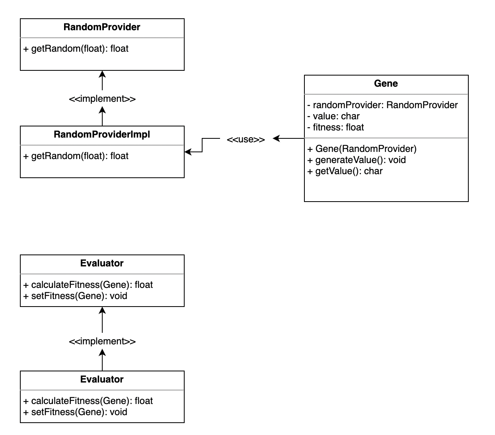

# genAlgo

Simple implementation of <a href="https://pl.wikipedia.org/wiki/Algorytm_genetyczny" target="_blank">genetic algorithm</a>. Shared project to practice group collaboration.

Authors: Paweł Dąbrowski, Janusz Brodacki, Kamil Surowiec.

## Goals:
<ul><li>working in small group</li>
<li>practicing git branching, issues and documentation</li>
<li>using TDD</li></ul>

## Development progress

We are working to develop functioning Stage 4 on 11.01.2021 - CrossoverService.

## Workflow
- We use separate branches to develop each stage of project.
- Each stage consist of at least three steps: documentation, tests and implementation. They are developed in this order and depend on each other.
    - Documentation describes the task.
    - Tests are our specification of product and we want them to describe acceptance conditions for implementation.
    - Implementation is developed at the end of the stage and it should pass all of the tests before release.
- On each stage we put tests before implementation. If during implementation step it appears, that tests are not sufficient, we extend tests before continuing.
- <b>Each task in project is developed based on an Issue</b>. If there is no Issue for your work - create one. Use Issues to report bugs or possible enhancements also.
- When stage is finished, we release it, by pulling current branch to <b>main</b>.
- Each task is developed on separate branch - naming conventions is explained below.

## Branch naming convention
- Production code is release on <b>main</b>
- Stage branches are formed as <b>dev-sX</b>, where X is number of development stage.
- Task branches follow this pattern: <b>X-Label</b>, where X is number of an Issue and Label is short description.

## Stage 1

Creation of Gene class, which is base fundament of our model. Adding RandomProvider interface to test creation of random genes.

## Stage 2

Creation of Evaluator interface and its implementation. 

## Stage 3

Documentation refactoring, added new section Code Structure which describe structure of program.

Gene class refactor, gene has field with single char insted of char array.

## Stage 4

Creation of CrossoverService to provide gene values recombination in order to find optimal solution in next generation.

## Code Structure

> class Gene
> 
> private final RandomProvider
>
> private char value
> 
> private float fitness
>
> private void generateValue()

Gene has two fields char value and float fitness, generateValue() method use RandomProvider interface to randomly generate char value.

> interface Evaluator
>
> calculateFitness(Gene)
>
> setFitness(Gene)

Evaluator has two method calcuateFitness(Gene) to calculate fitness of gene and setFitness(Gene) to assign calculated value of fitness to gene field fitness.
Evaluator count fitness only by comparing two char. One current value in gene with target char
Target char should be passed to Evaluator as argument in constructor

> Formulas for setFitness() method:
>
> variant 1:  1 / (1+log10(1+delta))
>
> variant 2: (65535 - delta) / 65535
>
> where:
>
> delta - Absolute value of difference between target and current char
>
> 65535 - value equal to Character.MAX_VALUE

CrossoverService, an interface responsible for changing gene values (mix their values) to increase their chances 
to match with optimal solution during next generation.

> interface CrossoverService
> void cross(Gene g1, Gene g2)

Multiple implementantations (strategies) describe how provided Gene objects should be changed:

| Strategy                          | gene 1                        | gene 2                        |
| --------------------------------- | ----------------------------- | ----------------------------- |
| MixingHalvesCrossoverServiceImpl  | 2nd byte copied from g2       | 2nd byte copied from g1       |
| OddBitesCrossoverServiceImpl      | odd bits copied from g2       | odd bits copied from g1       |
| EvenBitesCrossoverServiceImpl     | even bits copied from g2      | even bits copied from g1      |
| BitPairCrossoverServiceImpl       | odd bit pairs copied from g2  | odd bit pairs copied from g1  |

