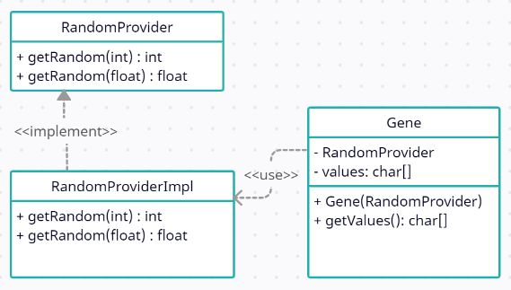

# genAlgo

Simple implementation of <a href="https://pl.wikipedia.org/wiki/Algorytm_genetyczny" target="_blank">genetic algorithm</a>. Shared project to practice group collaboration.

Authors: Paweł Dąbrowski, Janusz Brodacki, Kamil Surowiec.

## Goals:
<ul><li>working in small group</li>
<li>practicing git branching, issues and documentation</li>
<li>using TDD</li></ul>

## Development progress

We are working to develop functioning Stage 1 on 21.12.2020

## Stage 1

Creation of Gene class, which is base fundament of our model. Adding RandomProvider interface to test creation of random genes.

> class Gene
> 
> private final RandomProvider
> 
> private char[] values;

Gene should have <b>char[] values</b> initialized with random char length and random char values on each element.

## Stage 2

Creation of Evaluator interface and its implementation. Evaluator has one method setFitness() which is used to count fitness of gene. 
   

> interface Evaluator
>
>setFitness(Gene)
